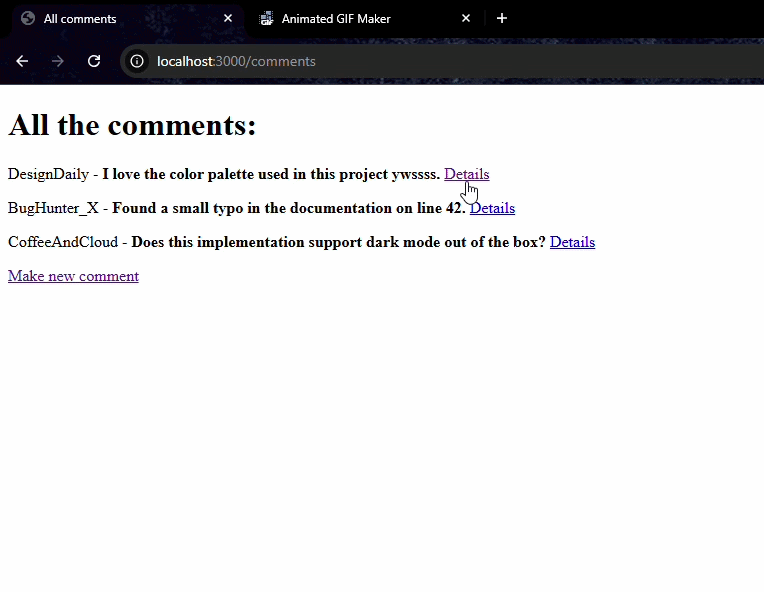

# express-fundamentals-crud

Project Overview:
This project explores building a RESTful API with Node.js and Express.js, focusing on the CRUD cycle and efficient in-memory data management.

Technical Stack
Backend: Node.js with Express.js routing and EJS for templating

Data Handling: Extraction using req.params and req.query.

Array Methods: Practical application of Mutable (.splice(), .push()) vs. Immutable (.filter(), .map()) patterns.

Key Learnings
Implementing standard HTTP methods (GET, POST, PATCH, DELETE).

Managing data type consistency (e.g., String params vs. Number IDs).

Structuring clean, maintainable backend logic using REST principles.

#Demo:

